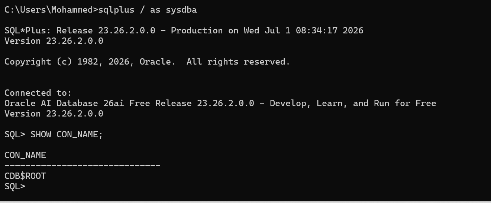

# Database Programming Assignment

## Task 1: Creating and Opening a Pluggable Database (PDB)

I successfully created the Pluggable Database `MO_PDB_31750_2025` and opened it in `READ WRITE` mode.

### Commands Used:
CREATE PLUGGABLE DATABASE MO_PDB_31750_2025 ADMIN USER mohammed_31750 IDENTIFIED BY 123456 FILE_NAME_CONVERT=('pdbseed', 'MO_PDB_31750_2025');
ALTER PLUGGABLE DATABASE MO_PDB_31750_2025 OPEN;
SHOW PDBS;

# Database Programming Assignment

## Task 1: Creating and Opening a Pluggable Database (PDB)

I successfully created the Pluggable Database `MO_PDB_31750_2025` and opened it in `READ WRITE` mode.

### Commands Used:
CREATE PLUGGABLE DATABASE MO_PDB_31750_2025 ADMIN USER mohammed_31750 IDENTIFIED BY 123456 FILE_NAME_CONVERT=('pdbseed', 'MO_PDB_31750_2025');
ALTER PLUGGABLE DATABASE MO_PDB_31750_2025 OPEN;
SHOW PDBS;

## Task 2: Create and Delete a Temporary PDB

I have successfully created a temporary PDB, opened it, and then completely removed it including its datafiles.

### Commands Used:
CREATE PLUGGABLE DATABASE MO_TO_DELETE_PDB_31750 ADMIN USER admin_temp IDENTIFIED BY 123456 FILE_NAME_CONVERT=('pdbseed', 'MO_TO_DELETE_PDB_31750');
ALTER PLUGGABLE DATABASE MO_TO_DELETE_PDB_31750 OPEN;
ALTER PLUGGABLE DATABASE MO_TO_DELETE_PDB_31750 CLOSE;
DROP PLUGGABLE DATABASE MO_TO_DELETE_PDB_31750 INCLUDING DATAFILES;
SHOW PDBS;

## Task 3: Oracle Enterprise Manager (OEM) and Environment Verification

I successfully accessed the Oracle Enterprise Manager (OEM) Database Express to monitor my Oracle environment. The dashboard confirms the database instance details, version, and status. Additionally, I verified the container environment using SQL Plus to ensure accurate configuration.

### Evidence:
1. **OEM Dashboard:**

2. **Container Verification via SQL Plus:**

